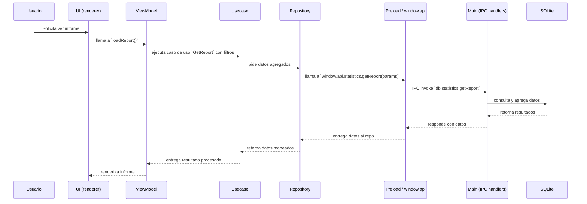

# Módulo de Estadísticas

Esta documentación describe cómo funciona el módulo de estadísticas en la aplicación Cronos. Incluye arquitectura, flujo de datos e interacciones principales.

## Resumen

- **Propósito:** Agregar, calcular y exponer métricas y estadísticas basadas en tareas, proyectos y tiempos almacenados en la base de datos local.
- **Alcance:** lógica en `src/main/database/ipc-handlers` (main), exposición segura por `preload`, y consumo en el renderer por los repositorios y usecases del módulo `statistics`.

## Arquitectura (alto nivel)

```mermaid
flowchart LR
  DB[SQLite / better-sqlite3] --> IPC[IPC handlers (main process)]
  IPC --> Preload[Preload / contextBridge (window.api)]
  Preload --> Repo[Repositories (renderer) — `statistics` module]
  Repo --> Usecase[Usecases / Domain logic]
  Usecase --> ViewModel[ViewModel (MobX)]
  ViewModel --> UI[Screens / Components]
```

## Flujo de llamada (secuencia típica)



## Puntos clave de implementación

- Handlers del lado main: revisar `src/main/database/ipc-handlers/statistics.ts` (si existe) o `src/main/database/ipc-handlers/*.ts` para las funciones relacionadas.
- Exposición segura: `src/preload/index.ts` agrupa y exporta `api.statistics.*` que usan `ipcRenderer.invoke`.
- Repositorios renderer: `src/renderer/src/modules/statistics/data/repositories` implementan llamadas a `window.api.statistics` y mapean resultados a modelos del dominio.
- Usecases y ViewModels: la lógica de negocio y preparación para UI está en `src/renderer/src/modules/statistics/domain` y `presentation/viewmodels`.

## Cómo extender / añadir una nueva métrica

1. Añadir la consulta/transformación en los handlers del main (o una función SQL/migración si hace falta).
2. Exponer un nuevo `api.statistics` en `src/preload/index.ts` (método con nombre claro).
3. Implementar método en el repositorio renderer que llame a `window.api.statistics.nuevoMetodo`.
4. Añadir un Usecase que utilice ese repositorio y preparar datos para el ViewModel.
5. Actualizar ViewModel y componentes UI (screens/components) para mostrar la nueva métrica.

## Archivos relevantes

- `src/main/database/ipc-handlers/` — handlers IPC que consultan la DB.
- `src/preload/index.ts` — exposición `window.api.statistics`.
- `src/renderer/src/modules/statistics/data/repositories/` — implementación de repositorios.
- `src/renderer/src/modules/statistics/domain/` — modelos y usecases.
- `src/renderer/src/modules/statistics/presentation/` — viewmodels y screens.

---

Si quieres, puedo:

- 1) Añadir diagramas adicionales por caso de uso concreto.
- 2) Actualizar `src/preload/index.ts` para agregar ejemplos de firmas `api.statistics`.

